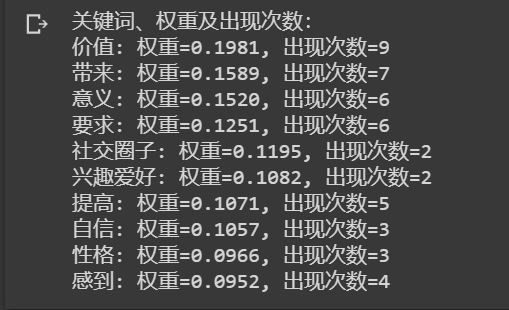

# Keyword Extraction关键词提取
目的：提取出AI爱家用户聊天记录中的关键词

运行环境：google colab

## 1.算法
这部分基于[jieba](https://github.com/fxsjy/jieba)中文分词组件依靠[TF-IDF](https://scikit-learn.org/stable/modules/generated/sklearn.feature_extraction.text.TfidfVectorizer.html)机器学习算法判断完成关键词提取。tf-idf是一种用于信息检索与文本挖掘的常用加权技术。这种统计方法，用以评估一字词对于一个文件集或一个语料库中的其中一份文件的重要程度。字词的重要性随着它在文件中出现的次数成正比增加，但同时会随着它在语料库中出现的频率成反比下降。

## 2.使用方法
+ pip命令安装jieba库
+ 根据需求修改jieba.analyse.extract_tags函数中的参数：topK 为返回几个 TF/IDF 权重最大的关键词，默认值为 20；withWeight 为是否一并返回关键词权重值，默认值为 False；allowPOS 仅包括指定词性的词，默认值为空，即不筛选
+ 更改text的内容后运行即可

## 3.代码及示例
[keyword.ipynb](keyword.ipynb)

